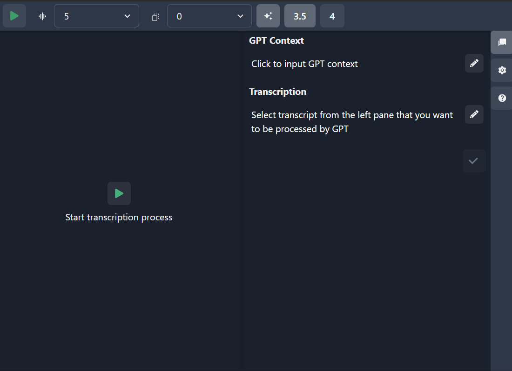
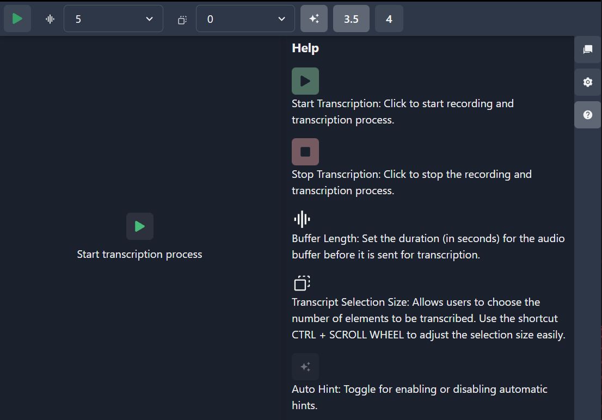

# Hintscribe :microphone: :speech_balloon:
Real-Time System Audio Transcription and ChatGPT Integration  
  
 
## :sparkles: Overview
Hintscribe is a cutting-edge application designed to transcribe system audio in real-time. It enables users to interact with the transcribed text, leveraging ChatGPT for various tasks like answering questions, translating text, or crafting witty comments for social platforms.  
  
 
## :hourglass_flowing_sand: Real-Time Transcription
**Instant Transcription**: As soon as audio is captured from your system, Hintscribe transcribes it in real-time, displaying the text on your screen.
Seamless Experience: Watch as spoken words are instantly converted into text, allowing for immediate interaction and response. 
## :point_up_2: Select and Interact
**Fragment Selection**: Simply select a portion of the transcription text. 
**ChatGPT Integration**: Use the selected text to engage with ChatGPT. Ask questions, seek translations, or get creative responses based on the selected transcription. 
## :bulb: Use Cases
**Interview Preparation**: Practice interview questions and refine your answers using real-time feedback.  
**Language Translation**: Translate spoken content instantly in various languages.  
**Content Creation**: Generate unique content for social media based on real conversations or audio content.  
**Educational Aid**: Transcribe lectures or educational content for study and revision.  
## :arrow_down: Download
Get the latest beta version of Hintscribe:  
[Download Hintscribe v0.1.1 (Beta)](http://github.com/SlowPx/hintscribe/releases/tag/0.1.1)
  
Please note that this is a beta release and the application is still in production. We appreciate any feedback or suggestions for improvements as we continue to refine Hintscribe.  
## :wrench: Installation and Setup
Detailed instructions on installing and configuring Hintscribe for your system.

## :book: How to Use
Step-by-step guide on using Hintscribe to its full potential.

## :question: Troubleshooting
Common issues and their solutions for a smooth Hintscribe experience.

## :phone: Support
Contact information for additional support or feedback.

## :star2: Future Developments
Stay tuned for exciting upcoming features and improvements!
